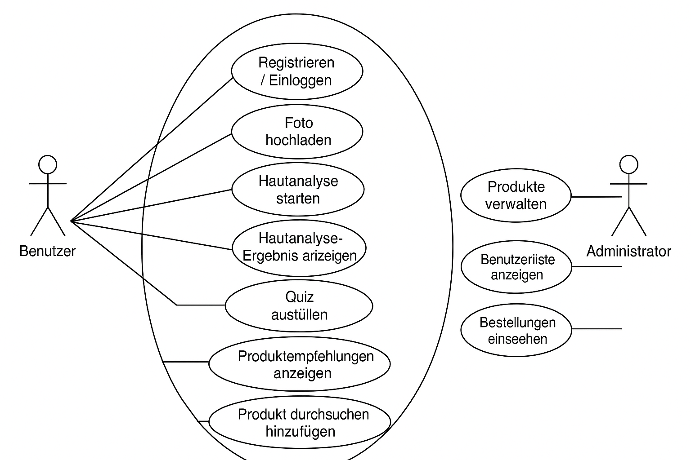
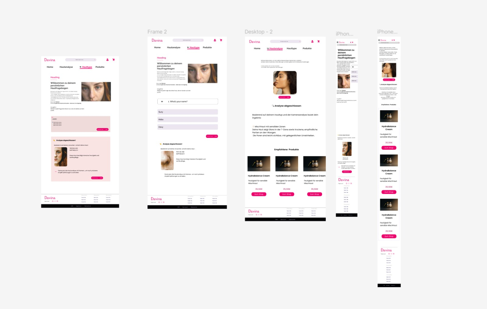
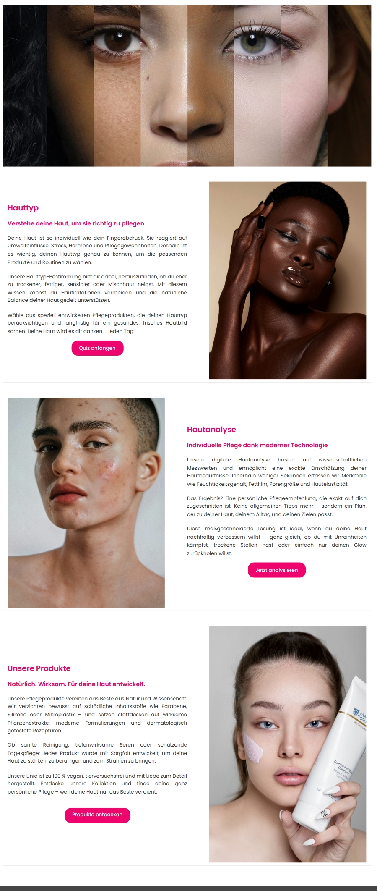
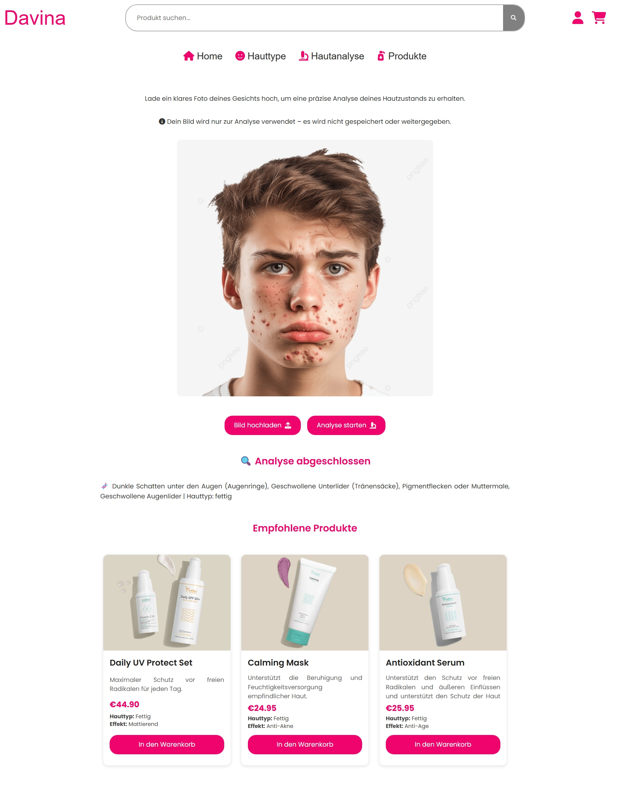
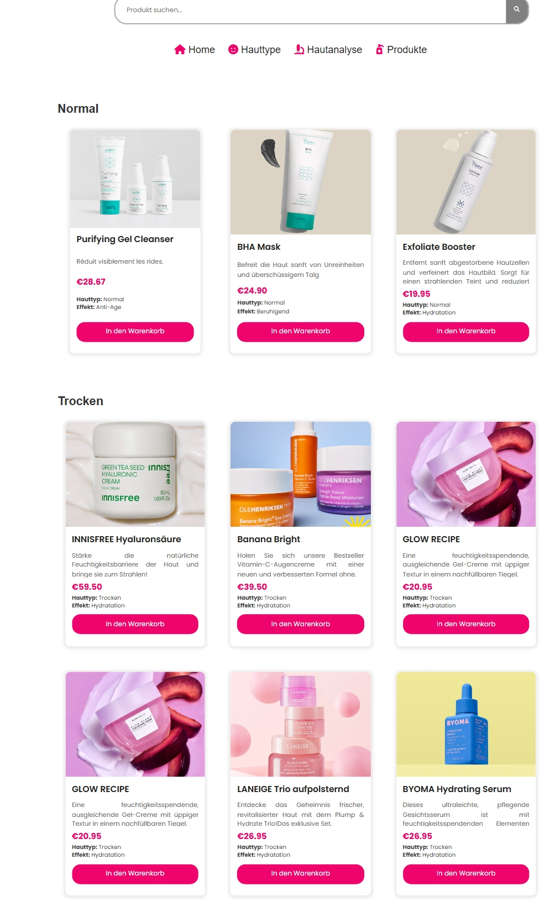
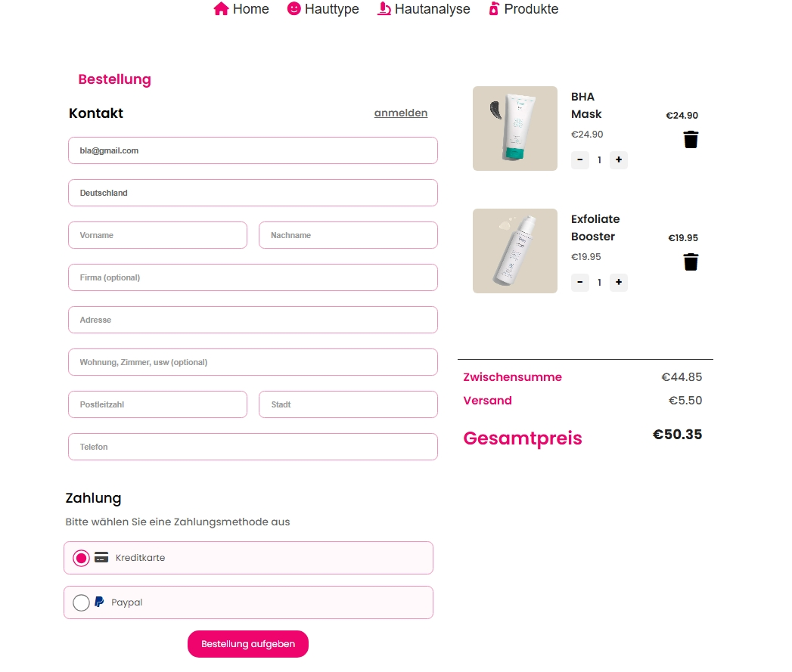
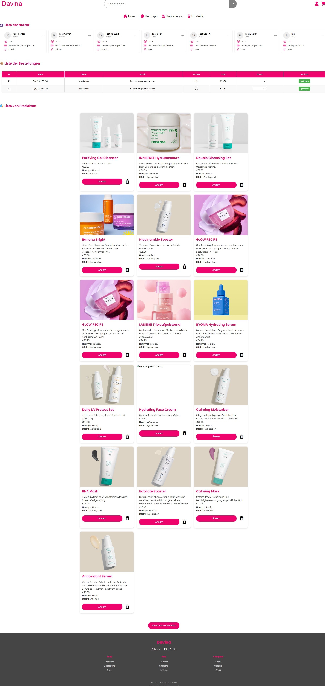

# 🧴 Skincare Fullstack Web Application (SoSe 2025)

Diese Webanwendung ist ein Fullstack-Projekt im Bereich E-Commerce und Hautpflege. Die Plattform ermöglicht es Benutzer:innen, Hautpflegeprodukte zu kaufen sowie eine personalisierte Hautanalyse durchzuführen. Die Analyse basiert auf einem hochgeladenen Foto, das mithilfe eines Algorithmus Hautunreinheiten erkennt (z. B. Akne, Rötungen, Trockenheit). Anschließend werden passende Produkte empfohlen.

Neben der Analyse bietet die Plattform einen klassischen Online-Shop, in dem Benutzer:innen weitere Produkte entdecken, in den Warenkorb legen und kaufen können.

## 🚀 Ziel

Entwicklung einer modernen und interaktiven Webanwendung, die zwei zentrale Funktionen vereint:

1. Eine **personalisierte Hautanalyse**, die auf Bildverarbeitung basiert und gezielte Produktvorschläge liefert.
2. Einen **funktionalen Webshop**, in dem Benutzer:innen Hautpflegeprodukte entdecken, auswählen und erwerben können.
3. Ein **Hauttypen-Quiz**, das durch Auswertung der Antworten den Hauttyp bestimmt.

Das Projekt legt besonderen Wert auf:

- eine klare Trennung zwischen Frontend und Backend (Clean Architecture),
- eine reibungslose Benutzerführung (UX),
- sowie den Einsatz moderner Technologien wie TypeScript, Angular, Docker, API und JWT.

---

## 🧩 Funktionen (User Stories)

### 👤 Als anonymer Benutzer

- Als anonymer Benutzer möchte ich mich registrieren und einloggen können, damit ich auf personalisierte Funktionen zugreifen kann.

### 🧑‍💻 Als eingeloggter Benutzer

- Als eingeloggter Benutzer möchte ich ein Foto von meinem Gesicht hochladen können, damit meine Haut analysiert wird.
- Als eingeloggter Benutzer möchte ich die Analyseergebnisse mit klaren Empfehlungen sehen, damit ich gezielt Produkte auswählen kann.
- Als eingeloggter Benutzer möchte ich empfohlene Produkte direkt in den Warenkorb legen können, damit ich sie später kaufen kann.
- Als eingeloggter Benutzer möchte ich auch andere Produkte durchsuchen und in den Warenkorb legen können.
- Als eingeloggter Benutzer möchte ich meinen Warenkorb verwalten (hinzufügen, entfernen, Menge ändern), damit ich meine Bestellung anpassen kann.
- Als eingeloggter Benutzer möchte ich eine Bestellung abschließen und bezahlen können, damit ich die gewünschten Produkte erhalte.
- Als eingeloggter Benutzer möchte ich ein Hauttypen-Quiz ausfüllen, damit mein Hauttyp automatisch bestimmt wird.

### 🔐 Als Administrator

- Als Admin möchte ich Produkte erstellen, bearbeiten und löschen können, damit das Sortiment aktuell bleibt.
- Als Admin möchte ich die Benutzerliste sehen können, um die Plattform zu verwalten.
- Als Admin möchte ich Bestellungen und Zahlungen einsehen können, um den Überblick über den Shopbetrieb zu behalten.

---

## Installing nodemodules in Backend 

tap npm install in folder backend/

## Installing and accessing web application

After cloning the repository,

run this from the root directory to start both the front- and backend:

```
docker compose up --build
```

Access web application via:

http://localhost:4200/

For Log-In Credentials check user_credentials.md

## Starting frontend test

Run this from the frontend directory to install all dependencies:

```
npm install
```

Run this to start the frontend test:

```
npm test
```

## Starting backend test

Run this from the backend directory to install all dependencies:

```
npm install sequelize
```

Run this to start the backend test:

```
npm test
```

## 🧠 Schritt 1: Modellierung

### 📌 Use-Case-Diagramm



---

## 📷 Produktbilder mit imgbb

Für die Darstellung der Hautpflegeprodukte in der Anwendung nutzen wir den Online-Dienst [imgbb](https://imgbb.com/)

### 🔄 Vorgehensweise

1. Das Produktbild wird lokal ausgewählt und auf der Webseite [imgbb.com](https://imgbb.com/) hochgeladen.
2. Nach dem Hochladen wird das Bild digitalisiert und online gespeichert.
3. Der Dienst generiert automatisch einen **öffentlichen Link** (z. B. `https://i.ibb.co/xyz/produktbild.jpg`), der weltweit zugänglich ist.
4. Dieser Link wird anschließend in unserer **Datenbank** gespeichert, in einem Produktobjekt unter dem Feld `imageUrl`.
5. Beim Abrufen der Produkte wird dieser Link genutzt, um das Bild im Frontend anzuzeigen.

### 📦 Beispiel

```json
{
  "name": "Tagescreme SPF 30",
  "description": "Schützt die Haut vor UV-Strahlen und spendet Feuchtigkeit.",
  "price": 14.99,
  "imageUrl": "https://i.ibb.co/xyz123/tagescreme.jpg"
}
```

---

## 🧼 Code Style & Formatierung

Dieses Projekt verwendet [Prettier](https://prettier.io/) zur automatischen Codeformatierung, sowohl im Backend als auch im Frontend.

- Die Konfigurationen befinden sich in den Dateien:
  - `backend/.prettierrc`
  - `frontend/.prettierrc`
- Für das Frontend wurde zusätzlich ein spezieller Parser für Angular-Templates (`*.html`) konfiguriert.
- Ziel ist ein einheitlicher, lesbarer und wartbarer Code über das gesamte Projekt hinweg.

---

## Figma

### Design 1

[Figma](https://www.figma.com/design/l1hI7hAW5CqpYSgz5H3VtK/Pages?node-id=36-233&p=f&t=1BTEq4ENc5775i97-0)


### Design 2

[Figma](https://www.figma.com/design/l1hI7hAW5CqpYSgz5H3VtK/Pages?node-id=0-1&p=f&t=1BTEq4ENc5775i97-0)


## 🖼️ Screenshots

### 🏠 Startseite

<p align="center">
  
</p>

---

### 🧪 Hautanalyse – Bildauswertung

<p align="center">
  
</p>

---

### 🧴 Produkte

<p align="center">
  
</p>

---

### 🛒 Warenkorb & Bestellung

<p align="center">
  
</p>

---

### 🛒Admin Seite

<p align="center">
  
</p>

## 📚 Offizielle Dokumentationen & Nützliche Tools

### Backend-Entwicklung

| Technologie    | Dokumentation                                       | Beschreibung                                              |
| -------------- | --------------------------------------------------- | --------------------------------------------------------- |
| **Node.js**    | [Offizielle Docs](https://nodejs.org/en/docs/)      | JavaScript-Laufzeitumgebung für Serverseitige Entwicklung |
| **TypeScript** | [TS Handbuch](https://www.typescriptlang.org/docs/) | Typisiertes JavaScript-Superset                           |

### Datenbanken

| Technologie    | Dokumentation                                 | Beschreibung                          |
| -------------- | --------------------------------------------- | ------------------------------------- |
| **MongoDB**    | [MongoDB Docs](https://docs.mongodb.com/)     | Dokumentenorientierte NoSQL-Datenbank |
| **PostgreSQL** | [PostgreSQL Docs](https://node-postgres.com/) | Open-Source RDBMS                     |

### Sicherheit

| Technologie | Dokumentation                                          | Beschreibung                |
| ----------- | ------------------------------------------------------ | --------------------------- |
| **bcrypt**  | [npm bcryptjs](https://www.npmjs.com/package/bcryptjs) | Passwort-Hashing Bibliothek |
| **JWT**     | [jwt.io](https://jwt.io/introduction/)                 | JSON Web Tokens Standard    |

### Infrastruktur

| Technologie | Dokumentation                           | Beschreibung        |
| ----------- | --------------------------------------- | ------------------- |
| **Docker**  | [Docker Docs](https://docs.docker.com/) | Container-Plattform |

### Frontend

| Technologie | Dokumentation                           | Beschreibung              |
| ----------- | --------------------------------------- | ------------------------- |
| **Angular** | [Angular Docs](https://angular.io/docs) | Web Application Framework |

### Projekt-Dokumentation

| Tool          | Dokumentation                                    | Beschreibung                       |
| ------------- | ------------------------------------------------ | ---------------------------------- |
| **README.md** | [Markdown Guide](https://www.markdownguide.org/) | Standard für Projektbeschreibungen |
